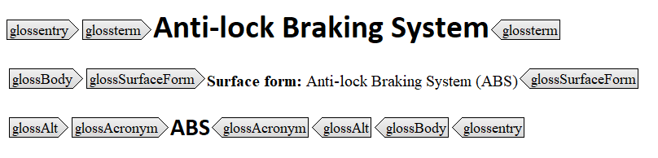

# Extra term information

Details about a `glossentry` element are defined in the `glossbody` element. It includes the elements in `glossAlt` \(see [Variants of a term](co_variant_of_term.md)\), as well as the following elements:

|Element|Description|
|-------|-----------|
|`glossPartOfSpeech`|Identifies the part of speech for the term, as well as alternate terms. The default part of speech is "noun" for the standard enumeration. Enter your value in the **Text** mode, for example:

 ```
<glossPartOfSpeech value="adjective"/>
```

|
|`glossScopeNote`|Clarifies the subject assigned by `glossterm`. The note contains extra info, such as examples of included or excluded companies or products.

|
|`glossSurfaceForm`|Specifies the term and the acronym of the term, so it can be used to introduce the term in new contexts. Later it is replaced by the acronym alone. The following figure illustrates a combination of `glossSurfaceForm` and `glossAcronym`:

 

|
|`glossSymbol`|Associates an image with the subject of the `glossterm`. You can link this image with the `@href` attribute.

|

**Related information**  


[General glossary elements](co_including_glossary.md)

[Variants of a term](co_variant_of_term.md)

[To create a glossary](ta_creating_a_glossary.md)

