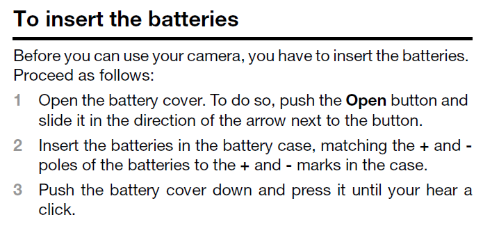
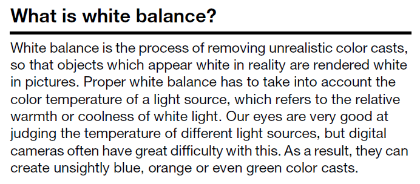
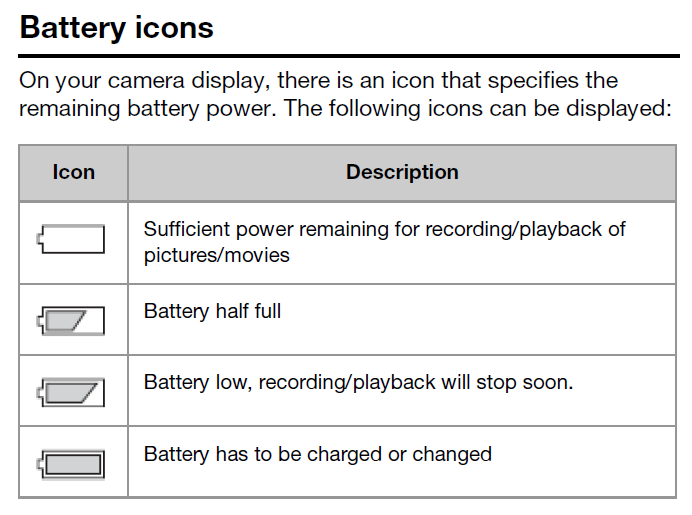

# Information types examples

## Task topic

This task topic answers the question "How do I insert batteries in my camera?" It includes all the steps the user has to execute to complete that task.

## Concept topic

This concept topic answers the question "What is white balance?" This background information can help users to properly set the white balance of their camera.

## Reference topic

This reference topic gives an overview of the battery icons that can be displayed on a camera. It allows users to quickly look up the meaning of a particular icon.

**Related information**  

[What is an information type?](co_what_is_an_information_type.md)

