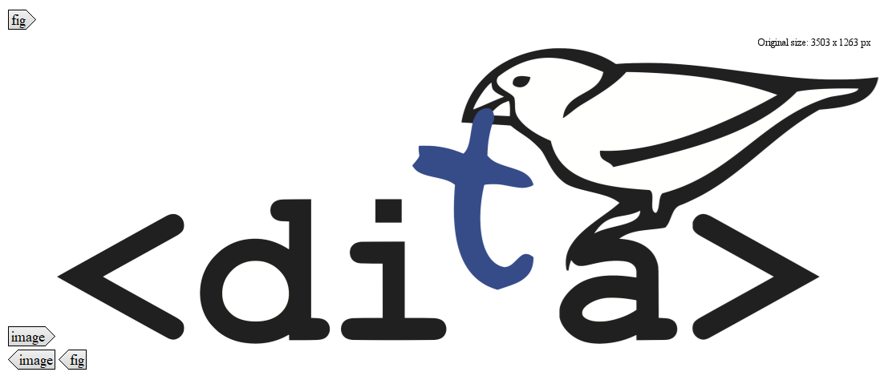

# Figures and images

Support your conceptual information with a graphic \(such as an illustration or a diagram\) whenever possible. Nearly all readers prefer to view a graphic if it helps them avoid reading text. To insert a graphic into a topic, you use the `fig` and the `image` element.

## `image`

All graphics have to be inserted into an `image` element. You can use the `@placement` attribute to define the position of the graphic.

**Tip:** Use the element for small, inline graphics. Wrap larger graphics into a `fig` element.

## `fig`

If you want to include a larger graphic in your topic, it is recommended to wrap your `image` element into a `fig` element. The graphic will then automatically be placed on a separate line. Besides, you can also add a title \(`title` element\) and a description \(`desc` element\) to your graphic when it is nested in a `fig` element.

**Note:** You can also use the `fig` and `image` element in task topics and reference topics. However, in a task topic you can only insert them inside an `info` element.

The following figure illustrates the use of `fig` and `image`:

**Related information**  

[Inserting images and videos in a topic](ta_inserting_images.md)

[Guidelines for working with graphics](re_guidelines_images.md)

