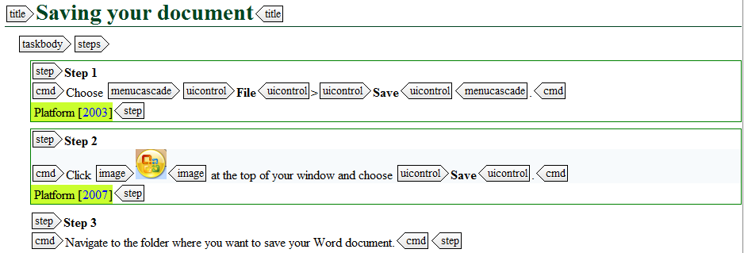

# How does conditional processing work?

Conditional processing means you apply attribute values to certain elements of your text. These values are then entered into a separate DITAVAL \(or a "conditional processing profile"[1](#fntarg_1)\) file in which you write rules that specify whether elements with those values need to be included, excluded \(filtering\) or flagged \(highlighting\). A DITAVAL file is used to filter your DITA content depending on the type of:

-   Audience that your content is addressing, for example a novice audience, an expert audience ...
-   Product that your content is about, for example iPhone X, iPhone 11, iPhone 11 Pro ...
-   Platform that your audience is working with, for example iOS 12.4, iOS 13 ...
-   ...

While generating output, the rules in this DITAVAL file are applied to the end-result. Below, the three main steps in conditional processing are described.

## Planning an attribute scheme

Before worrying about applying conditions, you should first establish a scheme and define exactly what you need to create conditions for. This way you can plan out which attributes you need and which values to assign to each of them. To do this:

1.  Define your audience: who will use your product and what specific information do they need?
2.  Define your platform: which operating systems, platforms and other environments are used with your product?
3.  Define your product: which models/versions are you planning and how do they differ?

**Important:** Each of the items you define should receive a unique value in an attribute. Do not reuse value names in different attributes as this will lead to confusion for your writers.

For example, you want to teach your users how to save their files using Microsoft Word, but you know there are several versions of Word on the market. As your documents only deal with Word 2007 and Word 2010, you plan your conditional attributes and values accordingly:

|Purpose|Attribute|Value|
|-------|---------|-----|
|Only for Word 2007|@platform|2007|
|Only for Word 2010|@platform|2010|

## Applying attributes

Once you have specified which values you need and in which circumstances you will need them, you can start applying them as you write. Applying them while writing is far easier than having to hunt through your documentation afterwards to find the elements that are product or audience specific.

You can apply conditional attribute values in:

|Element|Purpose|
|-------|-------|
|Topics|Include, exclude or flag specific elements|
|DITA maps|Include or exclude whole topics.**Note:** It is recommended to apply attributes to the topic references in the DITA map, and not to the `topic` element within the topic in question.

|
|Relationship tables|Include or exclude topic references.**Important:** Do not forget to exclude links to the files which you have excluded in the DITA map.

|

You can also include multiple attribute values separated by a space. The DITA-OT's default behavior is to include all content which has conditional attributes. So only if all exclude conditions are satisfied, will the element be excluded from the output. So if a paragraph is marked with both values admin manager, and the DITAVAL specifies that admin should be excluded, but manager included, the paragraph would be included.

**Tip:** You can change the DITA-OT's default behaviour by including `<prop action="exclude"></prop>` in your ditaval file.

You write the different steps for the different Word editions and apply the relevant attribute to each of them.



## Specifying a DITAVAL for filtering and highlighting

In order to filter and highlight certain elements from your generated output, you need to specify the 'rules' for what needs to happen to which values. You specify these rules in a DITAVAL file, which is applied when generating output.

If you want to filter content, you add strings of text to the DITAVAL file, for example: `<prop att="audience" val="expert" action="exclude">`. During publication, this element will be excluded in the output.

By flagging content, you highlight certain elements with a graphic style or give them icons to represent that they only apply for one appliance model, software version or operating system. These attributes are also logged in a DITAVAL file where you specify a flag to highlight the content. You can do this with one of the following actions:

-   Set the action to flag instead of exclude.
-   Use the `startflag` element to insert an image to highlight the conditional content.
-   Use the `alt-text` element to provide alternative text for the image.

You create a DITAVAL file and you specify strings for each Word value:

```
<val>
<prop att="platform" val="2003" action="flag">
<startflag imageref="Word_2003_Icon.jpg">
</startflag>
</prop>
<prop att="platform" val="2007" action="flag">
<startflag imageref="Word_2007_Icon.jpg">
</startflag>
</prop>
</val>
```

When you generate your content based on this DITAVAL file, the steps are flagged accordingly with a logo:


**Related information**  


[What is conditional processing?](co_what_is_conditional_processing.md)

[Which ditaval elements are available?](co_including_a_ditaval.md)

[1](#fnsrc_1) [https://www.oxygenxml.com/dita/1.3/specs/langRef/containers/ditaval-elements.html](https://www.oxygenxml.com/dita/1.3/specs/langRef/containers/ditaval-elements.html)

