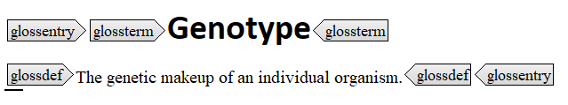

# General glossary elements

Glossary elements are defined with the `glossentry` element, containing:

-   `glossterm`: specifies the term associated with a definition
-   `glossdef`: specifies the definition associated with a term

**Note:** If multiple senses exist for the same term, create separate `glossentry` elements for each sense.

The following figure shows an example of a term being defined in a `glossentry`:

**Related information**  

[Extra term information](co_additional_term_information.md)

[Variants of a term](co_variant_of_term.md)

[To create a glossary](ta_creating_a_glossary.md)

