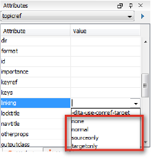

# What does @linking do?

## The @linking attribute

With the `@linking` attribute, you can control how and when links are displayed in your output. Sometimes it can be more useful for certain links not to be displayed, for instance, when you might want an installation topic to link to an uninstallation topic, but not the other way around. You can adjust the links by setting the `@linking` attribute to one of the following values:

|Value|Result|
|-----|------|
|none|This topic can't be linked to, nor can it link to other topics.|
|normal|The default setting. A topic with this value can be the target of links and can link to other topics.|
|sourceonly|This topic can only link to others, but cannot be linked to.|
|targetonly|This topic can only be linked to, but can't link to others.|

## Applied to relationship tables

Using these values of the `@linking` attribute, you can create different types of relationship tables, depending on how you want related links to appear in your output. There are two main types of tables:

-   One-way link table:

    This table is a two-column table in which you can create one-way links. You do this by setting the `@linking` attribute on the first column to 'source-only' and on the second column to 'target-only'. This way you ensure that only topics from the first column contain links to the second column and that topics from the second column do not link back.

-   Two-way link tables:

    This table is a two-column table in which you can create two-way links. In order to do this, you do not need to use any attributes as the default setting for linking is set to 'normal'. The relevant topic references will link to one another.

**Related information**  

[Relationship tables](co_including_reltable.md)

[To create a relationship table](ta_to_create_a_reltable.md)

