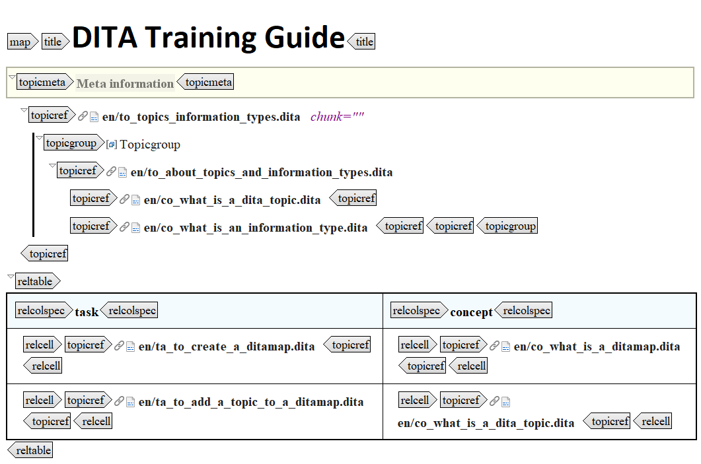

# What are the main components of a DITA map?

## Component list

The following components are most commonly used in a DITA map \(`map`\):

|Component|Purpose|
|---------|-------|
|`title`|Contains the title of your map. See [Map elements](co_creating_map.md).|
|`topicref`|Links topic or another DITA map. See [Map elements](co_creating_map.md).|
|`topicgroup`|Groups topics without affecting their hierarchy. See [Map structure elements](co_topichead.md).|
|`topichead`|Groups topics within the hierarchy. See [Map elements](co_creating_map.md).|
|`topicmeta`|Contains metadata for the topic that applies specifically to the context of the publication defined by the ditamap. See [Map structure elements](co_topichead.md).|
|`reltable`|Specifies relationships between topics, linking them outside of the relationships defined by the hierarchy. See [To create a relationship table](ta_to_create_a_reltable.md).|

## Example

The following image shows the main parts a DITA map can contain:

**Related information**  

[What is a DITA map?](co_what_is_a_ditamap.md)

[Why use DITA maps?](co_why_use_ditamaps.md)

[To create a new DITA map](ta_to_create_a_ditamap.md)

[DITA map elements](to_map_elements.md)

