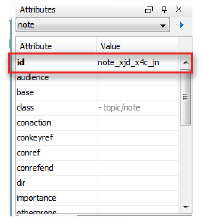

# What is the role of IDs?

When you want to link to an item, the program you use needs to be able to identify the item in question. It does this by checking its unique ID. However, in DITA, not all elements have an ID except in the case of the root elements \(`topic`, `concept`, `task` and `reference`\). The rest of the element IDs are optional.

When you want to link to an item that isn't a root element, you need to give it an ID first. You can do this by adding a random number to its `@id` attribute, or, more easily, you can have Oxygen automatically generate one. Oxygen allows you to right-click any element and choose **Generate IDs**.

**Note:** IDs are also important when re-using content.

The generated element ID of a `note` element:

**Related information**  

[Inline links](co_what_are_inline_links.md)

[Different types of links](co_types_links.md)

[Guidelines for creating links](re_guidelines_creating_links.md)

