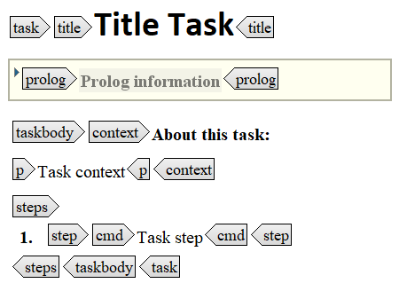
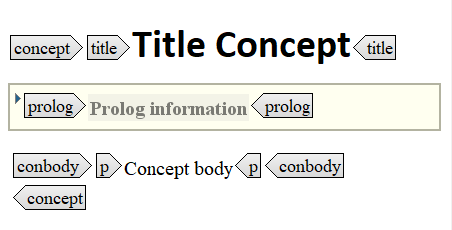
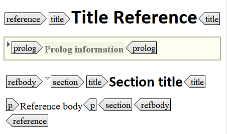

# Information types common structure

Task topics, concept topics and reference topics are all composed of a header and a body part. These parts contain the DITA elements. In all information types, the header contains the same elements, but the elements of the body part are specific for each information type:

| |Task topic|Concept topic|Reference topic|
|--|----------|-------------|---------------|
|Header|`title`, `prolog`|`title`, `prolog`|`title`, `prolog`|
|Body|`taskbody`containing `context` and `steps`|`conbody`|`refbody` containing `section`|

|Task template|Concept template|Reference template|
|-------------|----------------|------------------|
|

|||

Directly after the title, a `shortdesc` can be inserted, which is an optional but recommended element. It gives a preview of the topic. At the end of each information type template a `related-links` can be inserted. This element is recommended as you should avoid inserting links in the body.

**Related information**  

[What is an information type?](co_what_is_an_information_type.md)

