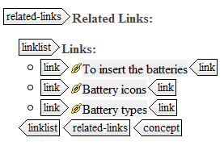

# Related links

With related links, you can link up topics outside of the hierarchical linking system of the DITA map and effectively create automated links based on non-hierarchical relationships. For example, if you have grouped all of your concepts together, you can link up one concept topic to all of its related tasks. To do so, the `related-links` element is used, which adds a list of cross-references at the end of your topic:

In the `related-links` element you can group `xref` elements to other topics. The related-links section is technically metadata, and is structured within the topic but outside the body elements.

To add structure to your related links, you can embed your cross-references in the elements `linklist` or `linkpool`:

-   `linklist`: contains links of which the order is important and therefore will be retained in the output
-   `linkpool`: groups your links according to their information type \(such as 'Related Concepts', 'Related Tasks', 'Related References' and 'Related Information'\)

Furthermore, you can use the following elements in links:

-   `linktext`: provides a line of text for a link:
    -   Used as the text for the specified link inside a topic
    -   Used as the text for generated links that point to the specified topic inside a map
-   `linkinfo`: contains a descriptive paragraph which is placed after the links that are contained in a `linklist`

Using related links is not always advised, as it causes similar issues as inline linking. The links are difficult to maintain: you need to remember in which topics you put them and they decrease the re-use potential of your topics. When a topic requires cross-references to other topics where those cross-references will always be valid in the context of the topic, they should be contained within a related-links section after the topic body. In all other cases, cross-references should be defined in the relationship table of the ditamap.

An example of a linklist:

An example of a linkpool:

**Related information**  

[To create a related links list](ta_insert_reference_in_relatedlinks.md)

