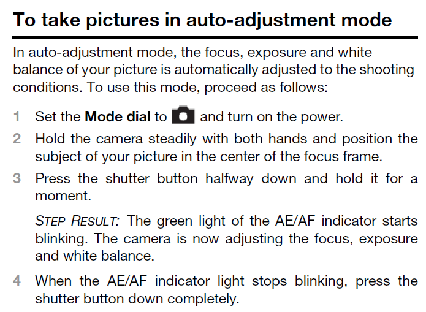

# What is a topic?

In DITA, all content is chunked into topics. Topics are discrete units of information, organized around a single subject or answering a single question. Each topic makes sense on its own and can be authored as a stand-alone piece.

A topic is traditionally composed of a title and some "content". That content can include:

-   One or more sentences
-   Tables
-   Lists \(bulleted lists, numbered steps...\)
-   Illustrations

This topic, for example, answers the question "How do I take pictures in auto-adjustment mode?" It is composed of a title, some introductory sentences and a list of numbered steps.

**Related information**  

[To create a new topic](ta_to_create_new_topic.md)

