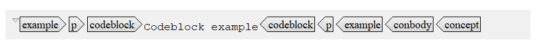

# What is an element?

In DITA, all content is chunked into units or topics. Topics contain several elements, which describe what kind of content you are writing.

For example, if you use a piece of code, you label this text with the element `codeblock`.

**Related information**  

[What is a topic?](co_what_is_a_dita_topic.md)

[Which elements make up the information types?](co_specific_elements_information_types.md)

