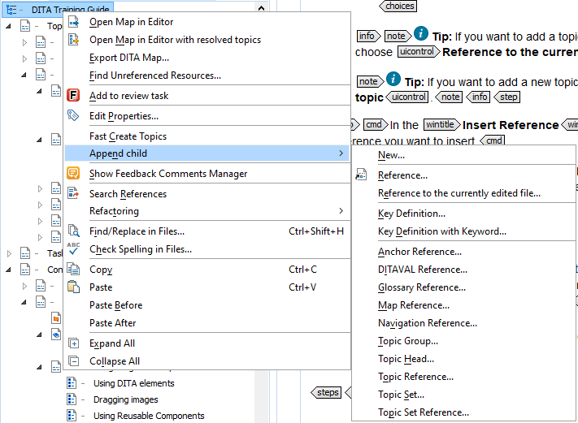

# To add a topic to a DITA map

1.  Open the **Insert Reference Topic** dialog window:

    -   Click  **Insert Reference** at the top of the **DITA Maps Manager**.

        **Tip:** If you cannot see this icon, click  **Settings** and select **Show extended toolbar**.

    -   Right-click your DITA Map and choose **Append child** \> **Reference**

        

    **Tip:** If you want to add a topic you are currently working in, choose **Reference to the currently edited file**.

    **Tip:** If you want to add a new topic, choose **New...**.

2.  In the Insert Topic Reference dialog window, navigate to the reference you want to insert.

    **Note:** If you chose **Reference to the currently edited file** option, your current file will already be selected.

3.  Do one of the following:

    -   If you have more than one topic to add, choose **Insert** and repeat from step [2](#step_fmb_nrm_sfb) until you have added all the desired topics. Then click **Close** to return to your DITA map.
    -   Choose **Insert and close** if this is the only topic you wish to add.
4.  Save the DITA map.

    **Tip:** You can also drag and drop a topic file to your DITA map. You can drag files from your file system explorer, the Project view or the Open/Find Resources view.

**Related information**  

[What is a topic?](co_what_is_a_dita_topic.md)

[What is a DITA map?](co_what_is_a_ditamap.md)

