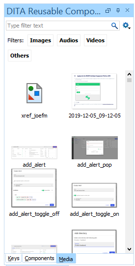

# To insert images using the Reusable Components pane

The Reusable Components view is a collection of reusable elements in your project.

1.  If necessary, open the DITA Reusable Components view via **Window** \> **Show View** \> **DITA Reusable Components**.

2.  Place the cursor where you want the image to be.

3.  Click the **Media** tab.

4.  Search for an image name in the **Type filter text** field.

5.  Add the image:

    -   Double-click the image.
    -   Click and drag the image.

**Parent topic:**[Adding images and videos](../en/to_adding_images_videos.md)

**Related information**  

[To insert images using DITA elements](ta_using_dita_elements.md)

[To insert images by dragging](ta_dragging_images.md)

