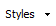
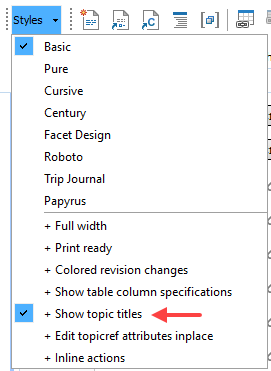
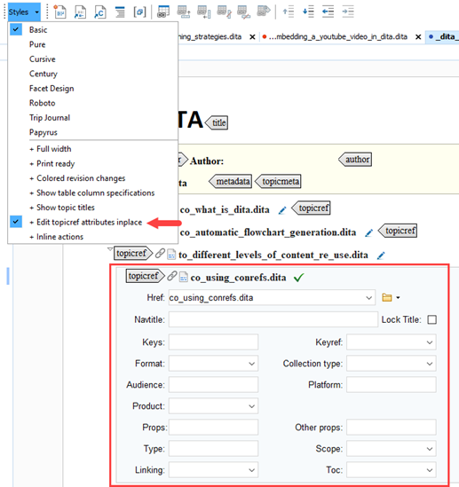

# Changing the style of ditamaps

**Parent topic:**[Tips for writing in Oxygen XML](../en/to_tips_oxygen.md)

## To display topic titles instead of file names

If you open a ditamap \(or bookmap\) in the **Author** mode in Oxygen, you will instantly notice that all the `topicref` elements are by default displayed according to their file name.

1.  To change the file names of `topicref` elements in a .DITAMAP file to their corresponding topic titles, proceed as follows:
2.  Select the **Styles** button in the toolbar: .

3.  In the selection menu that appears, select the option **+ Show topic titles**.

    

## To edit topicref attributes in place

Normally, you would change `topicref` attributes in the **Attributes** pane. If you want to adjust the attributes of `topicref` elements directly in the ditamap, you can use the **Styles** selection menu:

1.  Select the **Styles** button in the toolbar: .

2.  In the selection menu that appears, select the option **+ Edit topicref attributes inplace**.

    

