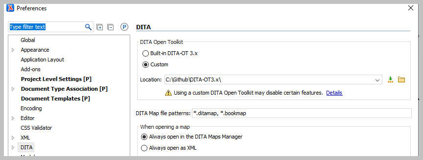
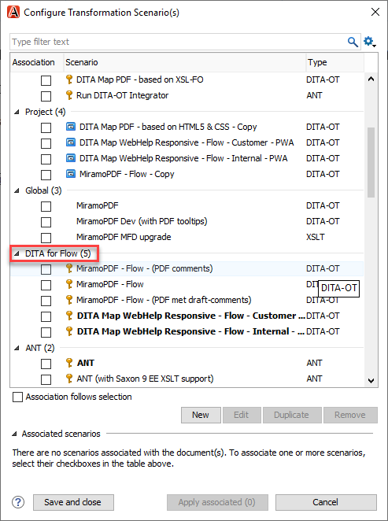
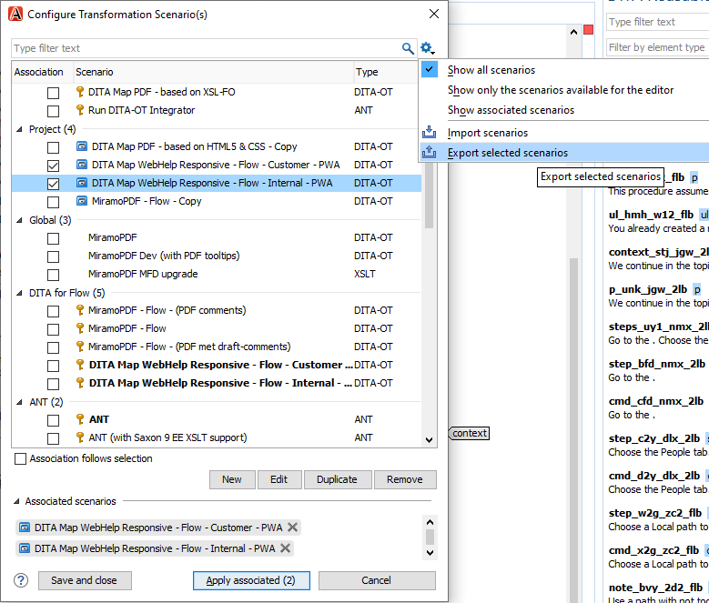
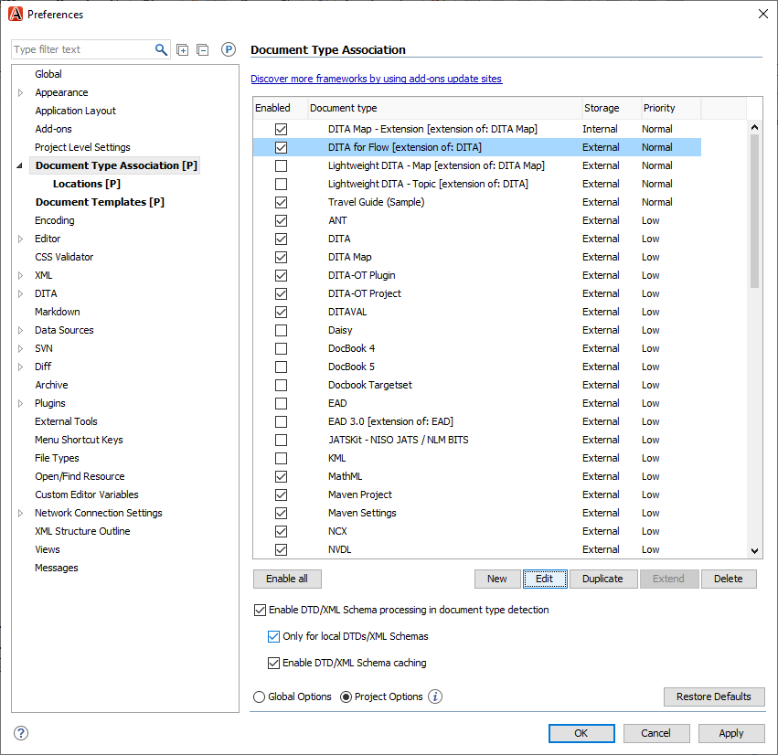
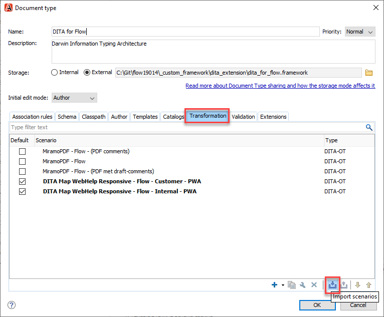
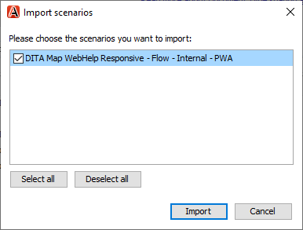
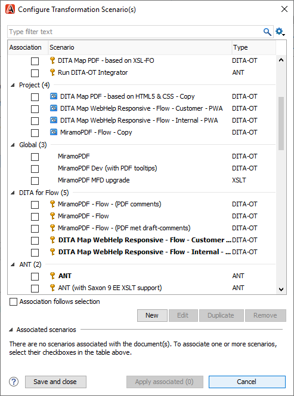

# Creating transformation scenarios

**Parent topic:**[Tips for writing in Oxygen XML](../en/to_tips_oxygen.md)

## To select a custom DITA-OT in Oxygen XML

1.  In Oxygen XML, choose **Options** \> **Preferences**.

2.  Go to **DITA.**

3.  Select **Custom** in the **DITA Open toolkit** section.

4.  Click  and browse to the location of the custom DITA-OT.

    

5.  Click **Apply** \> **OK**.

## To group transformations scenarios

If you have created a custom framework for a customer, you can group the transformations separately in the Configure Transformation Scenario\(s\) view, as seen below.

1.  In the DITA Maps Manager, click .

2.  In the Configure Transformation Scenario\(s\) window, select the transformation scenarios you want to add to a group.

3.  Click the **Settings** icon and click **Export selected scenarios**.

    

4.  Name and save the .scenarios file where you can easily find it.

5.  Click **Cancel** to close the Configure Transformation Scenario\(s\) window.

6.  In the menu bar, click **Options** \> **Preferences** \> **Document Type Association**.

7.  Under Document Type Association, click the grouping name you want the transformation to be a part of and click **Edit**.

    

8.  In the Document type window, click the **Transformation** tab and click the **Import scenarios** icon.

    

9.  Double-click the .scenarios file you exported earlier.

    The transformations you can import are shown.

    

10. Click **Import**.

    The transformations have been added to the group.

    

