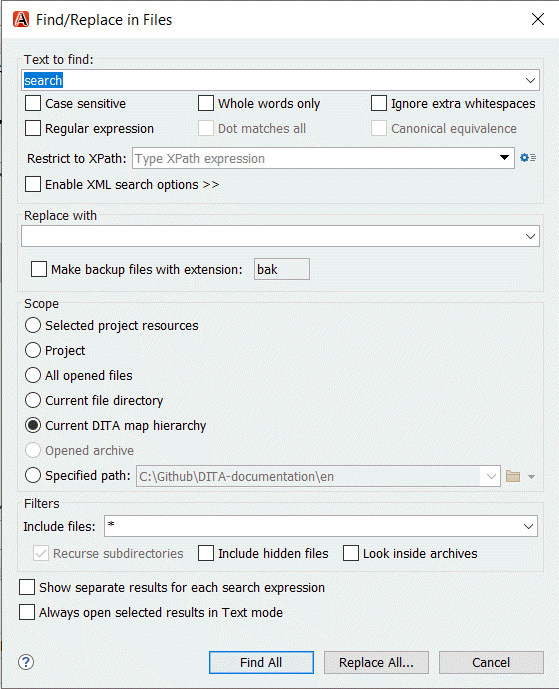

# Searching and replacing

**Parent topic:**[Tips for writing in Oxygen XML](../en/to_tips_oxygen.md)

## To use the find replace function

To quickly search all your topics for specific words, you can use the **Find Replace** function:

1.  Select **Find** \> **Find/Replace in Files...**

2.  Enter the word you want to search in the **Text to find:** field.

3.  Optionally, narrow down the search results:

    -   Check the boxes of the options you want to apply.
    -   Select nodes from XML documents using the **Restrict to XPath:** field.
    -   Check the box next to **Enable XML search options** to enable more search options.
4.  Optionally, enter a replacement and check the box to make backup files with the original word.

5.  Optionally, select the scope in which you want to search.

6.  Optionally, filter on file extension.

7.  Select **Find all** or **Replace all**.

    

## To add refactoring operations to the Oxygen XML editor

Refactoring operations are an advanced Search and Replace. It will help you to do bulk changes without losing a lot of time. You can add these scripts to the general Oxygen XML framework or a custom framework to make it visible for everyone you collaborate with. A refactoring operation is always defined as a pair of resources:

-   An XSLT Stylesheet or XQuery update script with the code to update the file
-   An XML Operation Descriptor file that contains the general information about the script

1.  Add the refactoring files \(script and descriptor file\) to the correct folder in your Oxygen XML project.

    C:\\Github\\DITA\\\_custom\_framework\\dita\_extension\\refactoring

2.  Choose **Options** \> **Preferences**.

3.  Go to **Document Type Association**, select your custom framework and click **Edit**.

4.  Under the **Classpath** tab, click .

5.  Add the URL to the refactoring operations and click **OK**.

6.  Click **OK** \> **Apply** \> **OK** to confirm the changes.

You are ready to use the refactoring operations. Double-check if the refactoring operations are added correctly by opening a DITAMAP in the DITA Maps Manager window, right-click on the DITAMAP and choose **Refactoring** \> **XML Refactoring**. You should see the newly added refactoring operations in the list.

**Note:** Sometimes you have to restart Oxygen XML to load the refactoring operations.

