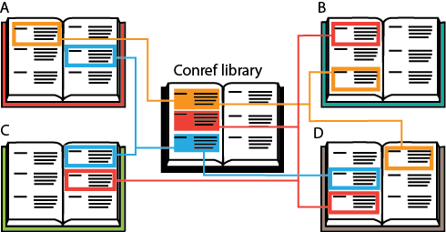

# The solution: a conref library

## About conref libraries

The problem with ['conref spaghetti'](co_conref_spaghetti.md) is that you lose track of where you placed your conrefs, meaning you have to start hunting them down throughout your files. Centralizing your conrefs is a good way to keep track of which elements you have referenced in your documentation. Instead of linking content from random topics as you write them, you immediately centralize all the elements you will re-use in one library file. This type of 'conref library' is a source file specifically designated for re-use. It is essentially a separate topic file in which you place all the text you intend to reference.

## Advantages of a library

By creating a centralized collection of conrefs, you enjoy the following advantages:

-   The original text is easier to locate in the centralized file. All other instances of the text are references.
-   The content is easier to update from one single location.
-   You can easily keep track in which topics the element is conreffed.
-   The referenced elements are no longer embedded in their context. This ensures you automatically follow the best-practices guidelines of writing self-contained text and are less likely to update it without realizing it is referenced content.
-   Your conref library also ensures that your writers do not become confused by all the conrefs spread across the many topics and that new writers know where to find all the information they might need.
-   It increases consistency between writers, as they use the same source file.

**Tip:** For larger documents it can be useful to create a conref library per type of text. For example: one library for steps, one library for warnings etc.

**Related information**  

[The risk: creating conref spaghetti](co_conref_spaghetti.md)

[To create a conref library](ta_create_conref_library.md)

