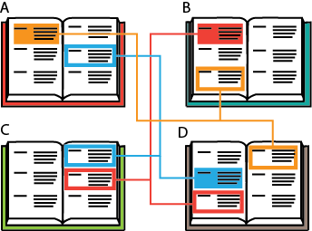

# The risk: creating conref spaghetti

No system is without flaws and, when not correctly implemented, using context references can create as many problems as it solves. One of the main dangers of using conrefs is what is often referred to as 'conref spaghetti' or 'spaghetti code'. This phenomenon occurs when you have created so many conrefs you start to lose track of where your conrefs originate and what files they impact.

Topic A might have a conref that is re-used in topics B and D. Topic D, in turn, has a conref that is re-used in topics A and C. Topic B, has a conref that is re-used in topic C and topic D.

When 'conref spaghetti' occurs, it becomes dangerous to start updating your referenced topics, as it is difficult to see if the text still applies in its new context. A good method for avoiding this problem is by creating a conref library.

**Related information**  

[The solution: a conref library](co_conref_library.md)

