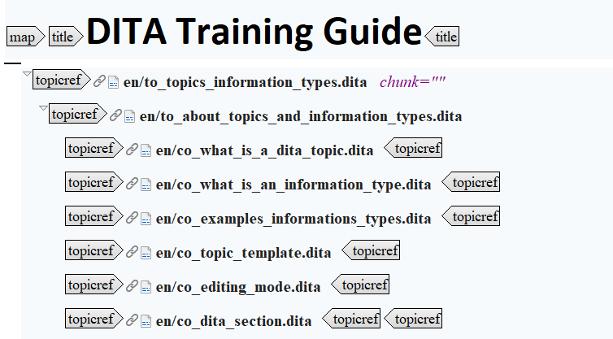
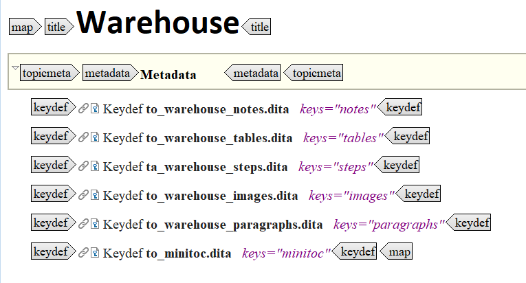

# Map elements

Creating a ditamap starts with the `map` element, which determines the relationships between DITA topics. Maps contain references to topics, maps, and other resources. In turn, these references are organized into groups, hierarchies, and tables. The following image shows the structure of a `map` element:

A map has a title at the top, contained by the `title` element. Topics or other resources are referenced with the `topicref` element. You can express hierarchies by adding children `topicref` elements to a parent `topicref` element. Nesting the topic references creates the hierarchy of your map.

**Note:** You can express relationships between `topicref` elements with the `@collection-type` attribute of a parent `topicref` or by using group and table structures \(`topicgroup` and `reltable`\). Relationships are expressed as links in the output.

As alternatives to a `topicref` element, you can use a `topichead` or `keydef` element. `topichead` elements reference only the title of a topic or other resource. These topics then appear as a heading in the output. The use of `topichead` elements is not recommended. The `keydef` element defines keys without including content in output, including a title in the table of contents and defining relationships. Although there are other ways to define keys, the `keydef` element is recommended as it simplifies the process.

**Note:** `keydef` elements are used to create warehouses \(conref libraries\):

**Related information**  

[What is a DITA map?](co_what_is_a_ditamap.md)

[What are the main components of a DITA map?](co_main_components_ditamap.md)

[Map structure elements](co_topichead.md)

[To create a conref library](ta_create_conref_library.md)

