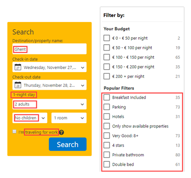

# Which ditaval elements are available?

The root element of a DITAVAL file is the `val` element. Furthermore, the following elements can be included in a DITAVAL:

## `style-conflict`

When two flagging methods are applied on the same element, usually the most deeply nested flagging method applies. However, when the flagging methods are applied on the same level, the `style-conflict` element can help determine how to resolve the conflict, using the following attributes:

|Flagging method|Conflict behavior|
|---------------|-----------------|
|Startflag/endflag|Add all flags that apply.|
|Color|Follow the `@foreground-conflict-color` attribute.|
|Backcolor|Follow the `@background-conflict-color` attribute.|
|Style|Add all font styles that apply.|
|Changebar|Add all change bars that apply.|

## `prop`

A `prop` element identifies an attribute, accompanying values and actions.

The attribute must be a conditional processing attribute:

-   `@platform`
-   `@product`
-   `@audience`
-   `@props`
-   `@otherprops`
-   Specialization of `props`

The actions must be one of the following:

|Element|Description|
|-------|-----------|
|Exclude|Excludes content from output, for example: `<prop att="audience" val="expert" action="exclude">`.|
|Include|Includes content from output, for example: `<prop att="audience" val="expert" action="include">`.|
|Passthrough|Includes content in output, and preserves the attribute value as part of the output for further processing, for example: `<prop att="audience" val="expert" action="passthrough">`.|
|Flag|Includes the content in the output and preserves the attribute value as part of the output stream for further processing within the \(dynamic\) output, for example: `<prop att="audience" val="expert" action="flag">`In other words, the conditional processing \(or filtering\) does not take place during the publishing phase of the DITA content. Instead, the various types of content and their corresponding attribute values are passed on to the output itself, which is where the filtering will take place.

**Note:**

Take for example a search engine with filtering options. A customer of Booking.com will be able to efficiently search through the many possible accommodations that the site offers by using "filters," which are essentially attribute values that have been attributed to the various types of content:



|

## `revprop`

The `revprop` element is used to flag a value in the `@rev` attribute.

## `startflag`

The `startflag` element is placed in the `prop` or `revprop` element and identifies the beginning of flagged content with an image or `alt-text` element.

## `endflag`

The `endflag` element is placed in the `prop` or `revprop` element and identifies the end of flagged content, with an image of `alt-text` element.

## `alt-text`

The `alt-text` element is placed in the `startflag` or `endflag` and provides alternate text for an image when the `@imagref` attribute sets an image to be used for flagging.

The following code illustrates a DITAVAL file:

```
<val>
<style-conflict backcolor="red"/>
<prop action="flag" att="product" backcolor="blue"
      color="yellow" style="underline" val="MyProd">
   <startflag imageref="startflag.jpg">
     <alt-text>This is the start of my product info</alt-text>
   </startflag>
   <endflag imageref="endflag.jpg">
    <alt-text>This is the end of my product info</alt-text>
   </endflag>
</prop>
<revprop action="flag" val="1.2"/>
</val>
```

**Related information**  


[What is conditional processing?](co_what_is_conditional_processing.md)

[Guidelines for conditional processing](re_guidelines_conditional_processing.md)

[To create a ditaval](ta_create_ditaval.md)

