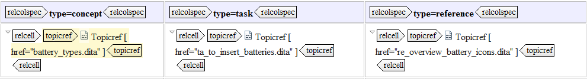

# Relationship tables

Next to `related-links`, you can also create links by using a relationship table. Instead of adding individual references in a topic, you centralize the relevant links in one location, the relationship table. This way you further increase the ease of use and navigation of your information. The `reltable` element specifies relationships among topics, based on the familiar table model of rows, columns, and cells:

|Element|Description|
|-------|-----------|
|`relrow`|Defines a row in a relationship table and contains `relcell` elements which contain related `topicref` elements.

|
|`relcell`|Defines a cell in a relationship table and contains `topicref` elements which are related to other `topicref` elements in the same row \(although not necessarily in the same cell\).

|
|`relheader`|Defines a row of column definitions \(`relcolspec` elements\) in a relationship table.

|
|`relcolspec`|Defines a column in a relationship table by setting default values for the `topicref` elements in the column. For example, you can set the `@type` attribute to "concept" and all `topicref` elements in the column \(with no attribute specified\) are treated as concepts. You can also add:

 -   A `topicref` element: defines a relationship between this topic and the topics that are referenced in the column
-   A `title` element: used as a label for the related links that are defined by the column

|

By default, the contents of a `reltable` element are not output for navigation or TOC purposes, and are used only to define relationships that can be expressed as topic-to-topic links. Relationship tables can be used in conjunction with hierarchies and groups to manage all the related links in an information set.

Using such a table presents the following advantages:

-   Centralization: as opposed to inline links which can be found in individual topics, relationship tables can only be placed in DITA map files. This means they are easy to find when you need to adjust something.
-   Reduced maintenance: as the links can all be found in one location, this makes it easier to adjust what you need in one go, rather than having to hunt through topics to find the link you need.
-   Improved re-usability: relationship tables make topics less dependent on other files than inline links do. This means there will be less trouble when you try to re-use the linked topics.

**Tip:** When you are working with particularly large documents, DITA maps can become heavy and full of topic references. As such, adding a relationship table to this can make it even more difficult to navigate. In this case, it can be useful to centralize the relationship table even more by adding it to a new DITA map nested within the main map. It should only contain the relationship table\(s\) and no other references outside of that table.

**Related information**  

[To create a relationship table](ta_to_create_a_reltable.md)

