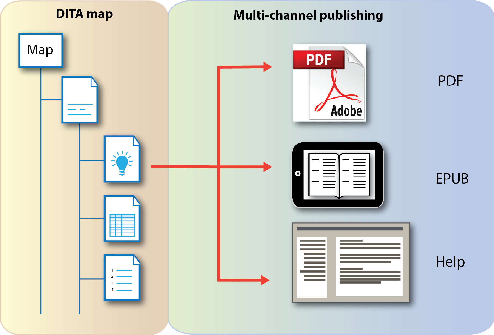

# What is multi-channel publishing?

Multi-channel publishing is publishing documentation in different output formats, such as webhelp or pdf.

One of the great advantages of DITA content is its ability to be published in many different kinds of output formats. Its characteristic re-use strategies along with conditional processing were designed with efficient content managing and publishing in mind. Essentially, one single-source map can become many different types of documents.

## Structure vs. lay-out

DITA is an ideal writing tool as it helps you organize your content into specific elements embedded within a larger, universal structure. These structuring elements have nothing to do with a lay-out, instead they are fixed compartments in which you store your documentation. This also means that when your documentation is fully written, the DITA file cannot be published and immediately used as is.

The advantage of this universal \(and free, open source\) structure is that it can easily be opened in other programs more suited for publishing, such as publishing tools or DITA processors \(Oxygen, XMetaL\), which will do the transformation for you. They transform your base DITA files into a publishable file of your choosing, and in doing so, apply a new lay-out on top of the structure. Lay-out, in this sense, is merely a layer that makes the structure more visible and accessible to the reader.

It is important to understand that the underlying structure is not changed when the DITA files are transformed. Your content does not change, it is merely put in a new outfit more suited to your needs.

In summary:

|DITA structure|Lay-out|
|--------------|-------|
|Focus on content|Focus on appearance|
|Fixed in unchanging elements.|Options change from program to program.|
|Will remain the same in different programs.|Might change if a document is opened in a different program.|
|Adheres to strict DITA rules.|Adheres to rules of the individual programs and to the user's preferences.|
|Allows the user to focus on content.|Can distract the user from writing content.|

## Publishing

During publishing, the DITA structure is used as the skeleton on top of which a skin of lay-out is applied. This publishing process involves a number of steps that interpret DITA maps, resolve `conref` elements and cross-references, apply formatting numbering and labels, and map DITA elements to output format elements.

During this process, the content is given a new look according to the requirements of the output format. Output which is intended to be viewed and used on a computer looks completely different from output designed, for instance, for tablets and phones. Each type has its own conventions and requirements, such as button size, font size, resolution etc.

