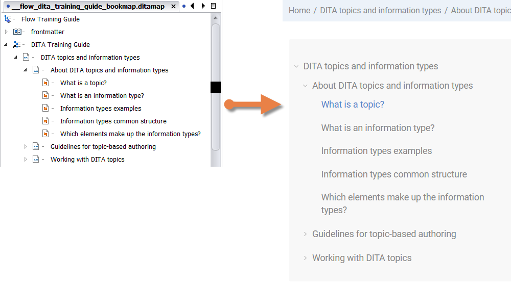
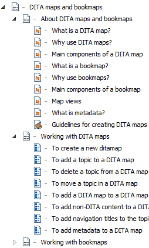

# Why create links?

A well-written document is useless to readers if it doesn't help them find the information they need or get from one topic to another. By linking topics together logically, you create a web of information and make it easier for readers to navigate to and retrieve the information they need.

One of the most useful features about DITA is that it automatically generates links in your output. For instance, links at the bottom of output topics are automatically generated by hierarchical relationships defined in the ditamap, non-hierarchical relationships defined in the relationship table of the ditamap, and links defined in the related-topic section of the individual topic. Of course, how links are generated will ultimately be up to the publishing engine you use.

## Map hierarchy

Your main DITA map hierarchy is the basic structure and table of contents that guides your reader through your information and ties all elements of your documentation together logically. This basic hierarchy is useful both for navigation and because it forms the basis for the links in your output. Your published table of contents will follow the same basic structure you defined in your DITA map.

The table of contents of this webhelp file follows the DITA map structure of the original document:

## Related links

Still, it can be useful to create links outside of that basic hierarchy. That way you can link up relevant content outside of the hierarchy, connecting, for instance, instructions for installing a program with instructions for uninstalling a program. It also means you can immediately link one topic to multiple related topics, allowing you, for instance, to connect a concept topic to its task topic and reference topic, rather than just to the next concept in the hierarchy.

In this example, the concept topics \(orange\) and the task topics \(blue\) are gathered in separate groups. Here, it can be useful to add related links, for instance, to link up 'What is metadata' with 'To add metadata to a DITA map'.

**Related information**  

[Different types of links](co_types_links.md)

[Guidelines for creating links](re_guidelines_creating_links.md)

