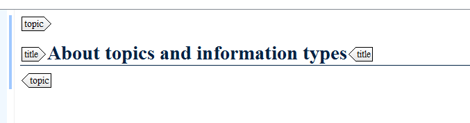
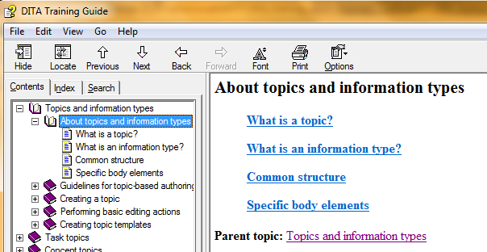
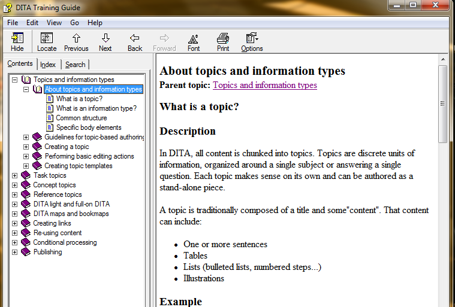

# Guidelines for creating DITA maps and bookmaps

It is useful to take some time to structure your information in your DITA map. A well-organized structure can go a long way in helping your reader find and understand information. As such, it is useful to keep in mind the following guidelines.

## Mind Miller's law \(7 ± 2\)

As much as it applies to creating sections within topics, Miller's law \(an average person can only hold 7 ± 2 objects in his working memory\) applies to creating structure in your DITA map. As such, it is advised to create a parent topic with around 7 child topics.

Additionally, the human mind can process about 4 concepts at a time, which means that when you start nesting topics, you should take care to create no more than four generations of topic families. The more you start nesting, the higher the chance the reader might start to lose track and forget how everything fits together.

## Use stub topics

When you are organizing your topics into groups, avoid using topic headings \(`topichead`\). Instead, use stub or summary topics: these are general topics that contain only a title.

This type of topic is automatically filled in with links to its child topics in output. If you want it to display content instead, you can use the `@chunk` attribute on this stub topic and enter the value 'to-content'. This way all information from the child topics will be added to the stub topic in the output.

A stub topic as it appears in DITA:

The same stub topic as it appears in webhelp. It only includes links to its child topics:

The same stub topic with the attribute `@chunk` and the value 'to-content' added to it. The stub topic is automatically filled in with the information from the child topics:

## Nest DITA maps

To further enhance your structure, you can also use DITA maps nested within other DITA maps. This can help you organize your content more clearly by separating complex collections of topics into a number of smaller, simpler collections. You can, for instance:

-   Organize your topics in separate DITA maps which represent different chapters. This way you enhance your structure to make it easier to navigate.
-   Re-use sets of topics. It is far easier to re-use a whole DITA map than it is to re-use every topic individually.
-   Divide your work load between colleagues. If everyone works in their designated DITA map, you decrease the risks of different writers working on the same file.

**Note:** Avoid nesting bookmaps within DITA maps as the structure will cause confusion for both processing software and documentation authors. Bookmaps should only be used at the top level.

**Parent topic:**[Guidelines for writing in Oxygen XML](../en/to_guidelines_and_tips_oxygen_xml.md)

**Related information**  

[What is a DITA map?](co_what_is_a_ditamap.md)

[What is a bookmap?](co_what_is_a_bookmap.md)

