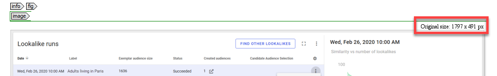

# Guidelines for working with graphics

## Storage

All images should be stored in a graphics folder in the same folder as your DITA map.

## Fig element

You can add both inline images and images which appear on the next line. To place the image on the next line, wrap the image in a `fig` element.

## Images in different outputs

In most projects, images will be different sizes. Images adapt to the screen when you create a webhelp, but for PDF, this will not be the case.

Therefore, if you choose a PDF output, use [DPI settings](https://en.wikipedia.org/wiki/Dots_per_inch) to scale the images. If the images are all more or less the same size, you can use one DPI value. When that is not the case, every single image has to be assigned a value. The values below might give you a sense of where to start:

-   fmdpi:124: for very small images \(such as icons\)
-   fmdpi:160: for images which are shown in their original size in oXygen \(when there is no information on the original size on the image\)

    

-   fmdpi:200: up to 1200 px
-   fmdpi:280: for images between 1200-1500 px
-   fmdpi:300: for images over 1500+ px

**Parent topic:**[Guidelines for writing in Oxygen XML](../en/to_guidelines_and_tips_oxygen_xml.md)

**Related information**  

[Figures and images](co_fig_image.md)

[Inserting images and videos in a topic](ta_inserting_images.md)

