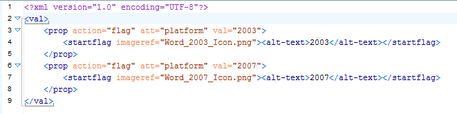

# To create a ditaval

1.  Choose **File** \> **New**.

2.  In the New dialog window, go to **Framework templates** \> **DITA** \> **Filter**.

3.  Enter a name and choose the "\_ditaval" folder to save the file.

4.  Click **Create**.

5.  \(Optional\) In the **Text view**, create `<val></val>` tags, if they are not yet present.

6.  \(Optional\) Create `<prop action="" att="" val=""></prop>` tags, if they are not yet present:

    1.  Type < and choose **prop** from the list that appears.

        **Note:** An `action=""` tag should already be present.

    2.  Place a space behind the quotation marks and choose **att** from the list that appears.

    3.  Place a space behind the quotation marks and choose **val** from the list that appears.

7.  Fill in the string for your value:

    **Tip:** You can copy-paste one empty string and fill it in according to your needs, so you do not have to create a new string for every value.

    1.  Enter the attribute name between the quotation marks of `att=""`.

    2.  Enter the matching value between the quotation marks of `val=""`.

    3.  Specify the associated action that needs to happen between the quotation marks of `action=""`. You can fill out include, exclude or flag.

    **Note:** You do not need to write a string to include every value. Values which are not in the DITAVAL file are automatically included.

8.  If you have set an action to flag, specify the kind of flagging you want in a new line underneath it:

    1.  Create the tags `<startflag></startflag>`.

    2.  If you want a particular image to introduce the flagged element, enter `imageref=""` inside the first tag and specify an image between the quotation marks.

        `<startflag imageref="logo.jpg"></startflag>`

    3.  If you want alternate text added to the flagged element, enter a `<alt-text></alt-text>` element between the `<startflag></startflag>` tags and fill out the alternate text between the two tags of the element.

        `<alt-text>Windows_content</alt-text>`

9.  Save your file under a recognizable name.

    **Tip:** You can use a renamed copy of this file for each product type for which you need to publish unique documentation. This way you only have to change the necessary values and actions, rather than having to create a new DITAVAL file per product.

**Related information**  

[What is conditional processing?](co_what_is_conditional_processing.md)

[Which ditaval elements are available?](co_including_a_ditaval.md)

