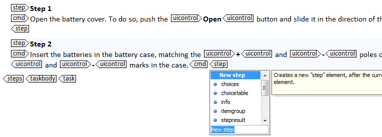
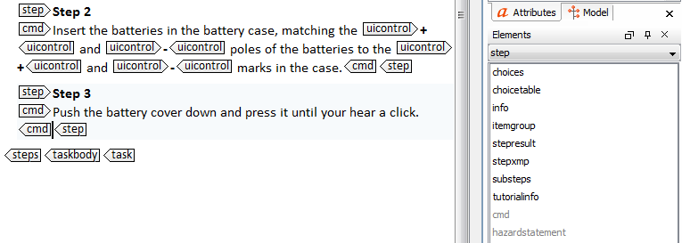

# To insert an element

1.  Place your cursor where you want to insert the element.

2.  Select the correct element:

    -   Press **Enter** and select the correct element in the displayed list of elements.

        

    -   Select the correct element in the **Elements** view.

        

        **Tip:** If the **Elements** view is not visible in the layout of your workspace, display it by choosing **Window** \> **Show view** \> **Elements**.

**Related information**  

[What is an element?](co_what_is_an_element.md)

