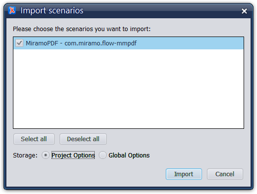
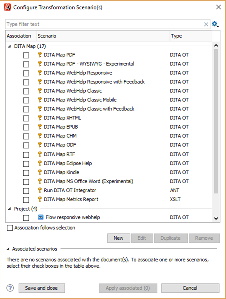

# Publishing DITA content in Oxygen XML

The Oxygen XML editors work with a build-in version of the DITA-OT. This is the standard DITA Open Toolkit completed with extra Oxygen XML plug-ins and patches. You can add custom plug-ins to the build-in version of DITA-OT at any time, but you will have to repeat this each time you install a new version of your editor.

You can also work with your own version of the DITA-OT when you change the standard preferences in Oxygen XML. Working your own version of the DITA-OT is useful when you collaborate and want to be sure that everyone works with the same version of the DITA-OT and the plug-ins.

**Parent topic:**[Oxygen XML](../en/co_oxygen_xml.md)

**Related information**  

[install_plugin_ot_oxygenxml]

[Using custom DITA-OT in Oxygen XML](ta_using_custom_dita_ot_in_oxygenxml.md)

## To select a custom DITA-OT in Oxygen XML

1.  In Oxygen XML, choose **Options** \> **Preferences**.

2.  Go to **DITA.**

3.  Select **Custom** in the **DITA Open toolkit** section.

4.  Click  and browse to the location of the custom DITA-OT.

    

5.  Click **Apply** \> **OK**.

## To create a transformation scenario

To create a custom webhelp transformation, you can simply finetune the Oxygen webhelp template:

1.  Open the ditamap you want to add a custom webhelp transformation scenario to.

2.  Select .

3.  Select a DITA Map Webhelp Responsive transformation scenario under **Project**.

    **Note:** If there are no DITA Map Webhelp Responsive transformation scenarios available yet under **Project**, simply duplicate the DITA Map Webhelp Responsive transformation scenario under **DITA Map**.

4.  Select **Edit**.

5.  For webhelp transformation scenarios, select a template under **Templates**.

6.  Change the values of the parameters under **Parameters**.

7.  Optionally, filter the ditamap on the **Filter** tab:

    -   Enter a ditaval file.
    -   Enter a profiling condition set.
    -   Manually exclude elements with defined profiling attributes.
8.  Select **Save template as**.

9.  Enter a name and description.

10. Check the box next to **Include HTML Page Layout Files**.

11. Enter a location next to **Save as** to save the template.

12. Unzip the folder.

You can now edit the transformation scenario by editing the files in the folder you created.

**Related information**  

[To change the parameters of a transformation scenario](ta_change_parameters_webhelp_transformation.md)

## To import a transformation scenario

In Oxygen XML you define all the different parameters for one publication in a transformation scenario. Once defined, you can reuse this scenario for all your publications and also share it with collaborators.

1.  Select a DITAMAP in **DITA Maps Manager**.

2.  Choose **DITA Maps** \> **Configure transformation scenario\(s\)**to open the list with transformation scenarios.

3.  Click the  icon and choose **Import scenarios**.

    

4.  Navigate to the .scenarios file you want to import.

5.  Select the .scenarios file, for example com.miramo.flow-mmpdf.scenarios, and click **Open**.

6.  In the Import scenarios dialog, select **Project Options** and click **Import**.

    

You imported the transformation scenario in your set of transformation scenarios and can run a publication with the imported settings.

## To export a transformation scenario

In Oxygen XML you define all the different parameters for one publication in a transformation scenario. Once defined, you can reuse this scenario for all your publications and also share it with collaborators.

1.  Select a DITAMAP in **DITA Maps Manager**.

2.  Choose **DITA Maps** \> **Configure transformation scenario\(s\)**to open the list with transformation scenarios.

3.  Select the transformation scenario you want to share, click  and select **Export selected scenarios**.

    

4.  Save the file.

You can share this scenario for example among collaborators to be sure that everyone is working with the same parameters.

## To publish DITA content with DITA-OT

1.  Click .

    The Configure transformation scenario\(s\) window opens.

    

2.  Select all transformations you want to associate with the Oxygen XML project and click **Apply associated**.

    The chosen transformations will be applied to the current project.

## To publish a single topic with resolved \(con\)keyref

Publishing a single topic where you used the \(con\)keyref mechanism by default results in empty spots in your final output because the keys cannot resolve. You can avoid this if you set the args.resources parameter and add a link to the master DITAMAP with all keys.

**Note:** The parameter args.resources is only available from DITA-OT 3.5.

1.  Click .

    The Configure transformation scenario\(s\) window opens.

    

2.  Open the transformation scenario you want to use.

3.  Search for args.resources in the **Parameters** tab.

4.  Click **Edit** and a do one of the following:.

    -   Add a relative \(or absolute\) link to the master DITAMAP.
    -   Add $\{rootMapFile\}.
    The variable $\{rootMapFile\} refers to the DITAMAP that is selected as **Context** in the DITA MAPS Manager window.

5.  Click **OK** \> **OK** \> **Apply associated** to start the publication.

